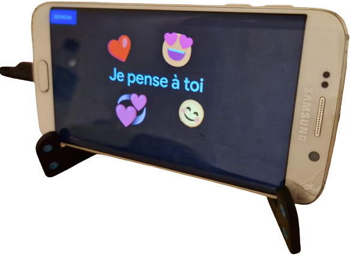
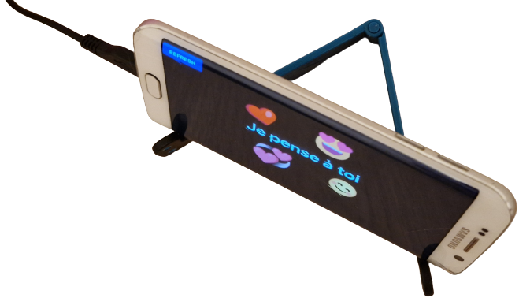

<h3 align="center">✨ avec HTML, CSS et JavaScript ✨</h3>

 

#

<h2>⭐ Requirements ⭐</h2>

×1 Téléphone + Navigateur / <a href="https://github.com/LeBazarDeBryan/DIY_Lovebox#-optionnel-">Application</a>

×1 Chargeur

×1 Réseau Wi-Fi / Données mobile

×1 Boîte (inspirez-vous de la boîte <a href="assets/images/lovebox.png?raw=true">Lovebox</a>) / Support pour maintenir votre appareil (<a href="https://github.com/LeBazarDeBryan/DIY_Lovebox#Exemple">Exemple</a>)

#

<h2>🌟 Étape 🌟</h2>

1. <a href="https://github.com/LeBazarDeBryan/DIY_Lovebox/fork">Dupliquer mon projet</a>.

2. Modifiez cette <a href="index.html#L37-L40">ligne</a> si vous voulez mettre un autre nom ou un autre format d'image ou de vidéo.

3. Déployez votre projet sur <a href="https://vercel.app">Vercel</a> (Rapide) ou <a href="https://pages.github.com">Github Pages</a> (Long).

4. Renommez vos images en "image.png" (ou le nom ou le format que vous avez mis)

5. Mettez vos images dans le <a href="images">dossier images</a> et regarder votre page.

<h3>↪ Optionnel ↩</h3>

0. Vous pouvez faire une application Android. (Vous avez besoin d'<a href="https://developer.android.com/studio">Android Studio</a>).

1. <a href="app">Télécharger ce dossier</a>.

2. Ouvrer ce dossier avec <a href="https://developer.android.com/studio">Android Studio</a>.

3. Cliquer sur "Project", Aller dans app/java/fr.lebazardebryan.lovebox/MainActivity

4. Aller à la ligne 18 puis changer "remplacer avec votre url" avec votre site web.

5. Cliquer sur "Build" > "Build Bundle(s) / APK(s)" > Build APK(s)

6. Après avoir attendu vous devrais avoir une notification quand c'est fini. Cliquer sur "locate".

7. Vous devrais voir un fichier avec le nom "app-debug.apk" c'est l'application. Transférer la sur votre appareil Android.

8. Installer l'application sur votre appareil puis ouvrez la.

9. Pour rafraichire appuyer sur "Refresh".

10. Et voilà ! Vous avez votre <a href="assets/images/lovebox.png?raw=true">Lovebox</a>.

#

<h2>💞 Utile 💞</h2>

Si vous n'avez pas d'idée d'image téléchargez-en <a href="database">ici</a> ou essayez cette <a href="https://diy-lovebox.vercel.app/draw.html">page</a>.

#

<h2>🌠 Demo 🌠</h2>

<a href="https://lebazardebryan.github.io/DIY_Lovebox/">Github</a>

<a href="https://diy-lovebox.vercel.app/">Vercel</a>

#

<h2>Exemple</h2>

  
#
  

